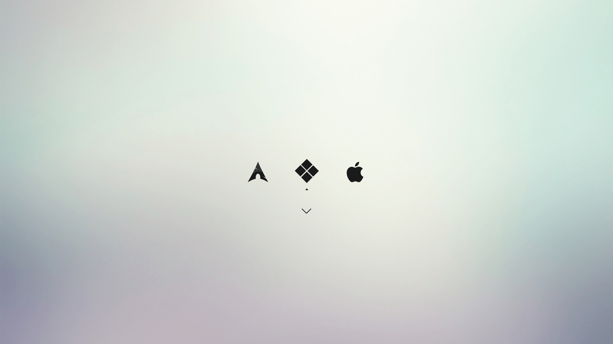
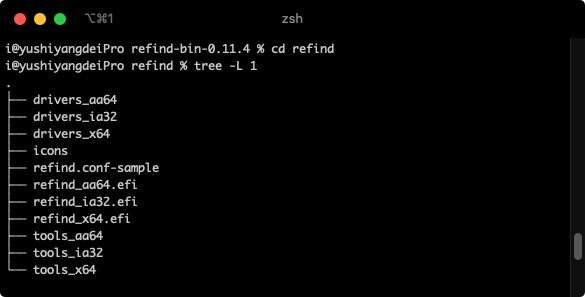

# rEFInd

一款美观且功能强大的 UEFI 启动管理器。



使用 rEFInd 可以轻松实现多系统启动：**Windows 10**、**macOS**（基于 OpenCore）、**Ubuntu** 等。

## 软件信息

| 项目 | 说明 |
|------|------|
| 版本 | refind-bin-0.14.2（最新） |
| 官网 | [rodsbooks.com/refind](http://www.rodsbooks.com/refind/) |
| 下载 | [SourceForge](https://sourceforge.net/projects/refind/) |
| 安装教程 | [官方安装文档](http://www.rodsbooks.com/refind/installing.html) |

## 主题

- [rEFInd Minimal](https://evanpurkhiser.com/rEFInd-minimal/) - 简洁风格
- [ursamajor-rEFInd](https://github.com/kgoettler/ursamajor-rEFInd) - 另一种主题
- 更多主题：[rEFInd Theme 标签](https://github.com/topics/refind-theme)

## 项目结构

```
rEFInd/
├── EFI/                      # 配置好的 rEFInd，引导 OC 和 WIN，使用 minimal 主题
│   ├── refind_x64.efi        # 主程序
│   ├── refind.conf           # 配置文件
│   ├── drivers_x64/          # x64 驱动（ext4、ntfs、btrfs 等）
│   └── themes/              # 主题目录
├── refind-bin-0.14.2/        # 官方最新版本，包含驱动和安装脚本
├── refind-bin-0.11.4/        # 旧版本，保留供参考
├── Themes/                   # 主题包，可复制到 rEFInd 目录下使用
└── Screenshot/               # 截图展示
```

## 安装 rEFInd

### 自动安装

在终端执行 `refind-install`，系统会自动将文件复制到 EFI 分区并建立启动项。

> 注意：如果不识别磁盘，可能需要手动复制 `drivers_x64` 驱动文件。如果存在多个 EFI 引导盘，安装位置可能不确定。

### 手动安装



推荐使用手动安装：

1. 将 `refind-bin-0.14.2/refind/` 目录复制到 EFI 分区
2. 删除不需要的驱动（如 aa64、arm、其他 32 位处理器驱动），只保留 `drivers_x64`
3. 使用 BCD、EasyUEFI 等工具添加 UEFI 启动项

## 配置 refind.conf

参考 `refind.conf-sample` 进行配置，以下是配置示例：

```conf
# 屏幕保护程序（30秒后启动）
screensaver 30

# 选择等待时间（秒）
timeout 2

# 屏蔽自动搜索的启动项
dont_scan_files \EFI\Microsoft\Boot\bootmgfw.efi
dont_scan_dirs /EFI/BOOT,/EFI/Microsoft,/EFI/OC,/EFI/ubuntu

# 手动添加启动项并设置图标
menuentry Ubuntu {
    volume "Ubuntu 18.04.3 LTS"
    loader \EFI\ubuntu\grubx64.efi
    icon \EFI\refind\themes\rEFInd-minimal\icons\os_ubuntu.png
}

menuentry "Windows 10" {
    volume "Windows 10"
    icon \EFI\refind\themes\rEFInd-minimal\icons\os_win.png
    loader \EFI\Microsoft\Boot\bootmgfw.efi
}

menuentry "macOS 10.15.2" {
    volume "macOS boot"
    icon \EFI\refind\themes\rEFInd-minimal\icons\os_mac.png
    loader \EFI\OC\OpenCore.efi
}

# 启用主题
include themes\rEFInd-minimal\theme.conf
# include themes\ursamajor-rEFInd\theme.conf
```
